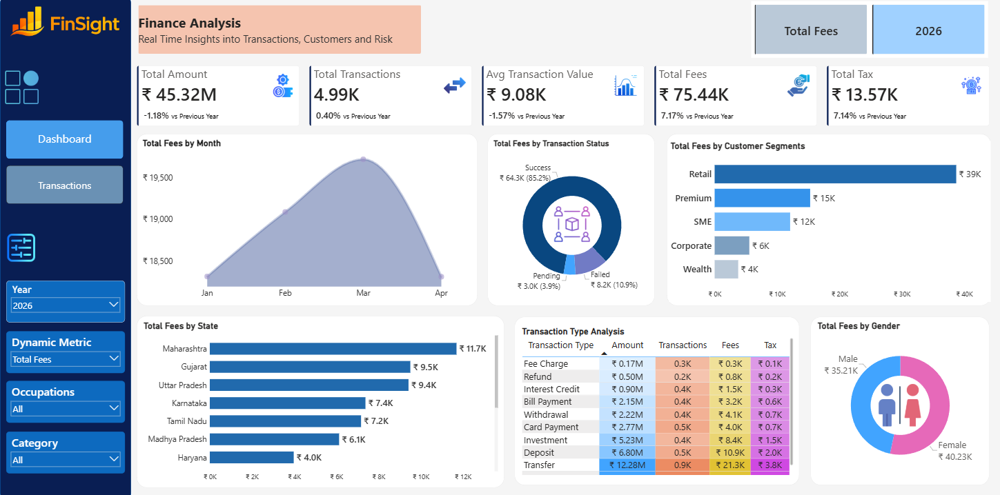
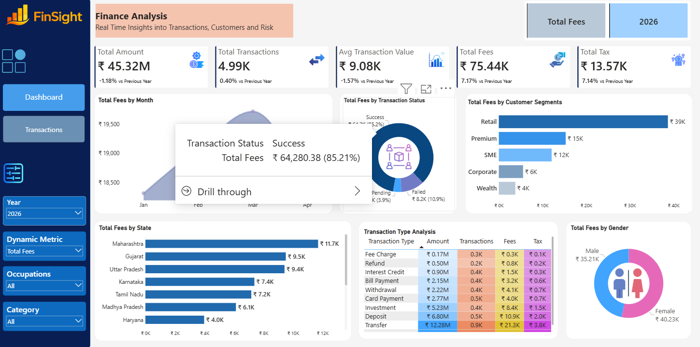
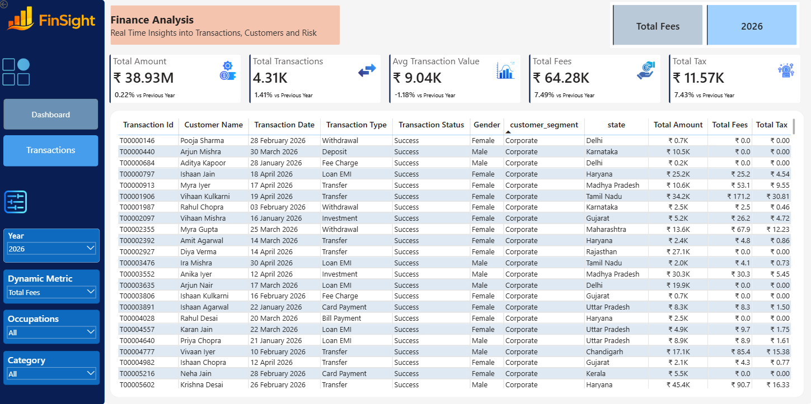

# 📊 FinSight – Finance Analytics Dashboard

## 🚀 Overview

FinSight is an interactive Finance Analytics Dashboard built in Power BI to monitor financial performance, transaction activity, customer segments, and revenue-related metrics. The dashboard provides stakeholders with a high-level overview of business performance while enabling deeper investigation through drill-through functionality.

The objective of this dashboard is to transform raw transaction data into meaningful insights that support operational monitoring and strategic decision-making.

---

# 📸 Main Dashboard

The main dashboard serves as the executive summary page, providing a consolidated view of financial performance through key metrics and interactive visualizations.

### 💰 Key Performance Indicators

At the top of the dashboard, key financial metrics provide an instant snapshot of business performance:

- Total Transaction Amount
- Total Transactions
- Average Transaction Value
- Total Fees Collected
- Total Tax Collected

These KPIs allow decision-makers to quickly assess the overall health of financial operations.

---

### 📈 Monthly Fees Trend

The monthly trend chart visualizes fee collection across different months, helping identify patterns, seasonality, and periods of higher business activity.

This enables users to track revenue consistency and monitor performance over time.

---

### 🔄 Transaction Status Analysis

The transaction status visualization categorizes transactions into:

- Success
- Failed
- Pending

This chart provides visibility into transaction processing efficiency and highlights potential operational issues that may require attention.

---

### 👥 Customer Segment Analysis

The customer segment chart compares fee contributions across various customer groups such as:

- Retail
- Premium
- SME
- Corporate
- Wealth

This analysis helps identify the most valuable customer segments and supports customer-focused business strategies.

---

### 🌍 State-wise Performance

The geographic analysis highlights fee contributions across different states.

By comparing regional performance, businesses can identify high-performing markets and uncover opportunities for expansion in underperforming regions.

---

### 💳 Transaction Type Analysis

Users can analyze different transaction categories including:

- Transfer
- Deposit
- Investment
- Card Payment
- Withdrawal
- Bill Payment
- Refund
- Interest Credit

The visualization supports dynamic metric selection, allowing users to compare transaction amount, count, fees, and taxes across categories.

---

### 🚻 Gender-wise Analysis

The gender distribution chart compares fee contributions between male and female customers, offering additional customer behavior insights.

---

# 🔍 Drill-Through Analysis

One of the most powerful features of the dashboard is the drill-through functionality.

Users can right-click on any transaction status, customer segment, state, or category and navigate directly to a detailed transaction-level view.

This creates a seamless transition from summary-level insights to granular records, making it easier to investigate trends, anomalies, and performance drivers.

### Why Drill-Through Matters

Instead of only viewing aggregated metrics, users can:

- Investigate individual transactions
- Validate trends observed in charts
- Explore customer-level details
- Analyze transaction history
- Perform deeper operational analysis

This feature significantly improves data exploration and decision-making efficiency.

---

# 📋 Transaction Details Page

The Transaction Details page acts as the final layer of analysis and is accessed through drill-through actions from the main dashboard.

When a user selects a specific category, state, segment, or transaction status, Power BI automatically filters this page to display only the relevant records.

### Available Information

Each transaction record includes:

- Transaction ID
- Customer Name
- Transaction Date
- Transaction Type
- Transaction Status
- Customer Segment
- Gender
- State
- Transaction Amount
- Fees
- Tax

This allows users to move from high-level business insights to detailed transaction-level analysis within a few clicks.

---

# 🔄 Dashboard Workflow

The dashboard follows a simple analytical flow:

### Step 1: Monitor Business Performance
View KPIs and summary visualizations on the main dashboard.

⬇️

### Step 2: Identify Trends or Anomalies
Analyze transaction status, customer segments, transaction types, and regional performance.

⬇️

### Step 3: Drill Through
Select any data point requiring further investigation.

⬇️

### Step 4: Explore Detailed Transactions
Access transaction-level records filtered specifically to the selected business context.

This workflow enables users to quickly transition from strategic insights to operational details.

---

# ✨ Key Features

- Interactive Finance Analytics Dashboard
- Dynamic KPI Monitoring
- Customer Segment Analysis
- State-wise Performance Tracking
- Transaction Type Analysis
- Monthly Trend Monitoring
- Gender-based Insights
- Dynamic Metric Selection
- Drill-Through Navigation
- Transaction-Level Investigation
- Clean and Interactive User Interface

---

# 🎥 Dashboard Demo

🔗 **Watch the Dashboard Walkthrough:**  
https://www.linkedin.com/posts/purva31_powerbi-dataanalytics-businessintelligence-ugcPost-7472935142739578880-ZbLd/?highlightedUpdateUrn=urn%3Ali%3Aactivity%3A7472935267495018496&origin=SOCIAL_SHARE&utm_source=share&utm_medium=member_desktop&rcm=ACoAAEU75ngBvXfd8M_FyYjswDgB6jlW9lGZZkg

---

## 🛠️ Built With

- Power BI
- DAX
- Power Query
- Data Modeling
- Interactive Visualizations

---

## 👩‍💻 Author

**Purva**

Data Analyst | Power BI | SQL | Python | Excel

Passionate about transforming data into actionable business insights through analytics and visualization.
